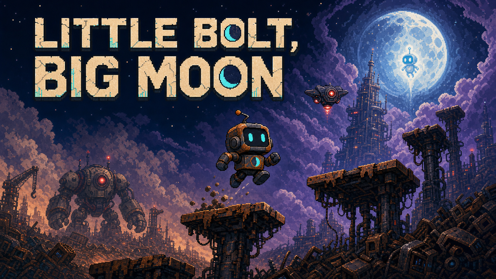

# Little Bolt, Big Moon



> Ein kleiner aussortierter Roboter. Ein riesiger Turm. Ein Freund, der auf
> dem Mond wartet.

**Little Bolt, Big Moon** ist ein schwieriges vertikales
2D-Präzisionsspiel für HTML5 Canvas. Byte klettert vom Schrottplatz durch
eine verlassene Fabrik, über den Wolken und durch eine alte Raumstation bis
zum Mond. Ein falscher Sprung oder ein gegnerischer Treffer kann ihn mehrere
Bildschirmhöhen zurückwerfen.

## Spielidee

Der Spieler bewegt Byte innerhalb einer hohen, zusammenhängenden Welt nach
oben. Statt klassisch nach rechts zu laufen, stehen präzise Sprünge, der
Umgang mit großer Fallhöhe und offene Gegnerphasen im Mittelpunkt.

Der Spielablauf:

1. Plattformen erklimmen und riskante Sprünge meistern
2. Zahnräder, Energiezellen und neue Waffen finden
3. Gegnerphasen überstehen, ohne heruntergestoßen zu werden
4. eines von drei Upgrades auswählen
5. nach einem Sturz verlorene Höhe erneut erklimmen
6. den Mond erreichen und den Endboss besiegen

## Wortlose Geschichte

Byte und Luma wurden gemeinsam als Reparaturroboter für eine Mondmission
gebaut. Wegen seiner schiefen Antenne wurde Byte jedoch aussortiert und auf
dem Schrottplatz zurückgelassen, während Luma allein zum Mond geschickt
wurde.

Die Geschichte wird nicht durch Dialoge erklärt. Transportkisten, alte
Produktionsanlagen, das geteilte Mondabzeichen und Lumas blaues Signal
erzählen während des Aufstiegs, was zwischen den beiden Robotern passiert
ist.

## Features

- zusammenhängende vertikale Welt mit 150.000 Pixeln Höhe
- fünf Biome mit insgesamt 15 unterschiedlich gebauten Abschnitten
- Kamera, die Byte beim Aufstieg und Fallen begleitet
- aufladbarer Präzisionssprung ohne nachträgliche Luftsteuerung
- statische, bewegliche und fallende Plattformen
- zwei normale Gegnertypen, Zwischenbosse und ein Endboss
- Rückstoß durch Gegner und Projektile
- Schraubenschlüssel und auffindbarer Bolzenwerfer
- wählbare Verbesserungen nach bestandenen Gegnerphasen
- lokale Highscore- und Höhenauswertung
- Desktop- und Touchsteuerung im Querformat
- gespeicherte Deutsch-/Englisch-Umschaltung in den Einstellungen
- Start-, Gewinn- und Game-over-Bildschirm
- wortlose Anfangs- und Endsequenz

## Landschaft

Die Umgebung erzählt gleichzeitig den Fortschritt:

```text
Mond und Endboss
        ↑
Raumstation und Sterne
        ↑
Wolken und Startturm
        ↑
Fabrik
        ↑
Schrottplatz
```

Warme Rost- und Industrietöne verändern sich während des Aufstiegs zu
Violett, Mondblau und Cyan. Der Mond wird im Hintergrund immer größer.

## Technik

- HTML5 Canvas
- objektorientiertes JavaScript
- JSON für Level-, Upgrade- und Assetdaten
- HTML und CSS für Menüs und responsive Oberfläche
- `localStorage` für Einstellungen und lokale Rekorde

Alle Klassen werden nach Verantwortung gegliedert. `script.js` bleibt ein
kleiner Einstiegspunkt und enthält keine Gameplaylogik.

## Projektstatus

Das Spiel ist vom Startbildschirm bis zum Ende spielbar. Der aktuelle Stand
ist ein Release-Kandidat: Gameplay, Gegner, Upgrades, Audio, responsive
Steuerung und Abschlusssequenz sind umgesetzt. Pflicht-Checkliste, Balancing,
Clean Code und lokale Release-Wege wurden vollständig geprüft.

## Extras über die Pflichtanforderungen

- 150.000 Pixel hohe Präzisionswelt statt eines kurzen Einzellevels
- 15 Abschnitte mit eigenen Sprungmustern und biomeabhängiger Schwierigkeit
- Zwischenboss-Sperren mit Statusanzeige zwischen den großen Gebieten
- auffindbare Waffe, Waffenwechsel und dauerhafte Verbesserungen im Lauf
- wortlose Umweltgeschichte vom Schrottplatz bis zum Mond
- lokal gespeicherte Rekorde sowie getrennte Musik- und Effektlautstärke

## Dokumentation

- [`docs/game-design.md`](docs/game-design.md) – Story und Spielkern
- [`docs/asset-guide.md`](docs/asset-guide.md) – visueller Stil und Assetgrößen
- [`docs/asset-licensing.md`](docs/asset-licensing.md) – Herkunft und Nutzung
- [`docs/project-structure.md`](docs/project-structure.md) – Ordner und Zuständigkeiten
- [`docs/quality-audit.md`](docs/quality-audit.md) – sichtbare und technische Abnahme
- [`data/asset-credits.json`](data/asset-credits.json) – Assetnachweise

## Asset-Hinweis

Das visuelle Konzept, das Gamecover und die Produktionsgrafiken wurden mit
OpenAI-Bildgenerierung erstellt, für das Spiel aufbereitet und im Projekt
dokumentiert. Herkunft und Nutzung aller eingebundenen Assets stehen in der
Lizenzdokumentation und in den Assetnachweisen.
